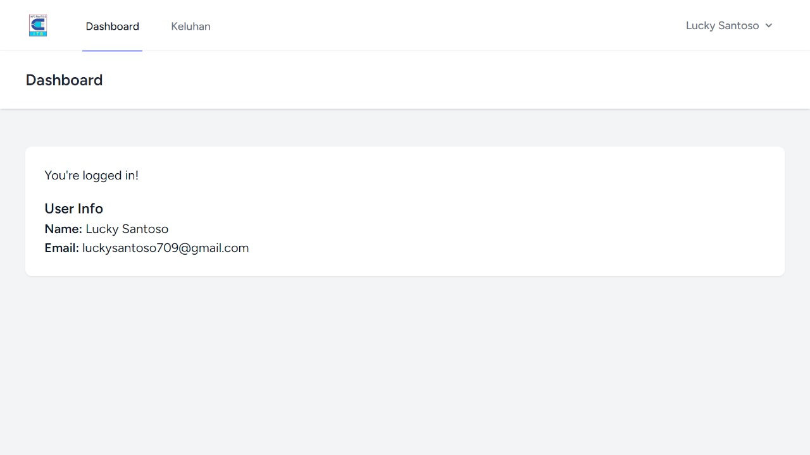

| Nama          | NRP        | Kelas    |
| ------------- | ---------- | -------- |
| Lucky Santoso | 5025221050 | PBKK (D) |

# Final Project Laravel "Management Keluhan Mahasiswa TC"

## Installation

### Composer Packages

```
composer install
```

## Configuration

### Create `.env` file from `.env.example`

```
cp .env.example .env
```

### Generate Laravel App Key

```
php artisan key:generate
```

### Migrate the Database Migration and Run the Seeder

```
php artisan migrate
```

## Run App

Install NPM packages first

```
npm install
```

Run local web server

```
php artisan serve
```

Open new console and run the app with Vite

```
npm run dev
```

## Test App

```
php artisan test
```

## UI Website

1. Tampilan Login
   

2. Dashboad
   

3. Keluhan Page
   

4. Create Keluhan
   
   

5. Replace and Update Keluhan
   
   

6. Delete Keluhan
   

7. Show Keluhan
   
